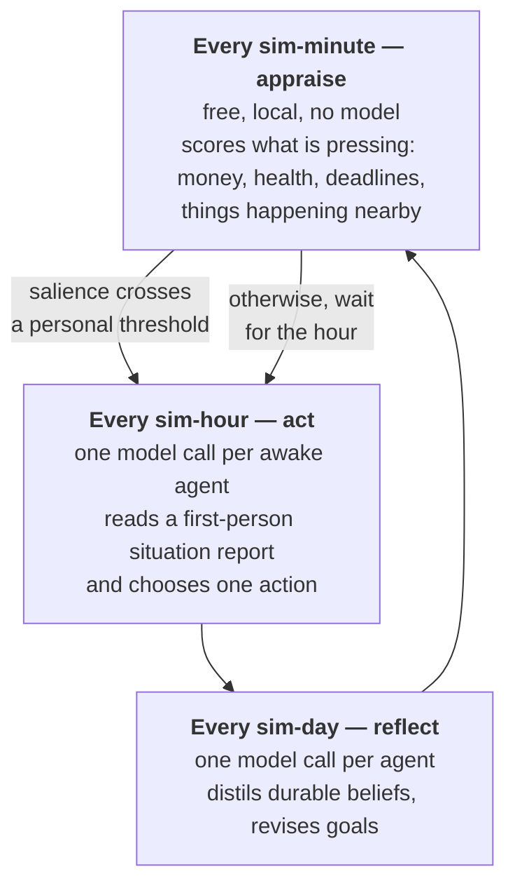
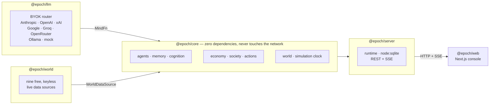

<div align="center">

# Epoch

**A simulation engine for intelligence.**

Hundreds of autonomous LLM agents living inside a persistent world grounded in real Earth.<br />
Real cities, real weather, real markets, real news. You give them a goal. They work out how.

[](https://github.com/rayhankhilji/epoch-engine/actions/workflows/ci.yml)
[](LICENSE)


*What Unity did for games, Epoch does for AI societies.*

</div>

---

## What this is

Not roleplay. Not AutoGPT. A sandbox where intelligent systems make long-term decisions inside a world
that doesn't care about their ambitions.

Every agent owns an identity, a personality, a memory, goals, beliefs, finances, relationships, a
reputation, a body, and a location on a real map. Every simulated hour they decide what to do with it.
Every simulated day they look back at their own life and revise what they think.

You tell an agent to *become a billionaire*. You do not tell it how. What happens next — the job it
takes, the company it founds, the friend it drops, the city it can no longer afford — is the agent's
own reasoning colliding with an economy that has real prices in it.

```
   $919.0k  Tomas Vance      Software Engineer, London     22% · Build a company worth over $1 billion
   $1.45M   Thea Vance       Founder, San Francisco        41% · Build a company worth over $1 billion
   $932.5k  Zara Qureshi     Founder, Bengaluru            18% · Build a company worth over $1 billion
```

Three people. Same goal. Wildly different capital markets. Watch who gets there and notice how much of
it was geography.

---

## Quickstart

```bash
git clone https://github.com/rayhankhilji/epoch-engine.git
cd epoch-engine
npm install
npm run sim -- --scenario unicorn --days 7
```

That runs with no API keys at all, on a deterministic mock mind — enough to watch the world turn.
To give the agents **real** minds, add a key for any provider:

```bash
cp .env.example .env      # then paste in one key — Anthropic, OpenAI, xAI, Google, Groq…
npm run dev               # engine + API on :8787
npm run dev:web           # console on :3000
```

Open <http://localhost:3000>, pick a scenario, press **Begin**.

---

## How the agents actually think

Epoch is LLM-first: **every decision an agent makes is made by a language model.** The problem is that
literally calling a model for every agent every simulated minute would bankrupt you before lunch. So
cognition runs on three nested cadences, and only the middle and outer ones cost money.



The minute-by-minute layer is what makes *"every minute they think"* affordable: it is arithmetic over
the agent's own state, it never touches a model, and it only escalates when something has genuinely
changed. Neurotic agents escalate sooner. Disciplined ones ride things out.

**The situation report** an agent receives before every decision is its entire conscious view of the
world — who it is, what it wants, what it can afford, who is nearby, what it remembers, what's in the
news, and what it could do with the next hour. It is built in [`cognition.ts`](packages/core/src/cognition.ts)
and is worth reading; it's the most load-bearing prose in the project.

### Memory, in three layers

| Layer | What it holds | Example |
|---|---|---|
| **Immediate** | A raw episodic stream of everything experienced | *"Met Ada at a dinner in SoMa. She's raising."* |
| **Long-term** | Beliefs distilled from that stream by nightly reflection | *"I hate owing people money."* |
| **Semantic** | A knowledge graph of people, places, orgs and concepts | `Ada —founded→ Thea Labs —based-in→ San Francisco` |

An agent's life is long and its context window is small, so before every decision the whole stream is
scored on **recency × importance × relevance** and only what surfaces is shown. Relevance uses TF-IDF
cosine similarity rather than embeddings — which keeps retrieval free, synchronous, offline and
deterministic, and that matters when you're doing it hundreds of times per simulated hour.

Memory also **fades**. The stream compacts: reflections and revisited moments survive, trivia from
months ago does not.

---

## Bring your own keys — and mix them

Which model powers an agent is set **per agent**, so a single world can be a genuinely mixed society of
Claude, GPT, Grok and Gemini agents living in the same city, competing for the same jobs, and forming
opinions about each other.

| Provider | Env var | Notes |
|---|---|---|
| Anthropic (Claude) | `ANTHROPIC_API_KEY` | Native structured output via the Messages API |
| OpenAI (GPT) | `OPENAI_API_KEY` | |
| xAI (Grok) | `XAI_API_KEY` | |
| Google (Gemini) | `GOOGLE_API_KEY` | |
| Groq | `GROQ_API_KEY` | Fast open-weight inference |
| OpenRouter | `OPENROUTER_API_KEY` | One key, many models |
| Ollama | `OLLAMA_BASE_URL` | Fully local, no key, opt-in |
| Mock | — | Deterministic, free, always available |

Keys are read from the environment and **never persisted, logged, or transmitted anywhere except to the
provider you chose.** Model ids are overridable per tier (`EPOCH_MODEL_ANTHROPIC_DEEP=claude-opus-5`),
as are prices for the cost meter.

The router handles the unglamorous parts: retries with jittered backoff, cross-provider fallback so a
rate limit can't stall a running world, a bounded response cache, forgiving JSON recovery for when a
model wraps its answer in prose, and a live cost tally broken down by provider.

```
Cognition
  1478 decisions · 1612 model calls · 3,151k in / 77k out · $2.84
  · anthropic     1204 calls  $2.61
  · xai            408 calls  $0.23
```

---

## The world is real

Nine live data sources. **Every one of them is free and none of them need a key.**

| Source | Supplies |
|---|---|
| [Open-Meteo](https://open-meteo.com) | Current weather for every city, one request per sim-day |
| [Yahoo Finance](https://finance.yahoo.com) | Equity and index prices |
| [CoinGecko](https://coingecko.com) | Crypto prices |
| [Frankfurter](https://frankfurter.app) | ECB foreign exchange rates |
| [Hacker News](https://news.ycombinator.com) | Technology and startup news |
| [GDELT](https://gdeltproject.org) | World news, any topic or language |
| [Nominatim](https://nominatim.openstreetmap.org) | Geocoding any place on Earth |
| [REST Countries](https://restcountries.com) | Currencies, languages, populations |
| [Hipolabs](https://github.com/Hipo/university-domains-list) | Real universities by country |

So when an agent in Lagos buys Apple stock, they pay what Apple actually traded at, converted at a real
ECB rate, out of a salary indexed to Lagos's actual cost of living. When it rains in London, it's
raining in London.

Every source is time-boxed, cached and permitted to fail. A total network outage degrades to empty data
and a warning — never an exception. A world with stale weather is still a world.

`resolveCity('Manila')` will geocode a city the bundled dataset has never heard of and give it real
coordinates, a real timezone and a real currency.

---

## Scenarios

A scenario states a goal and never a method.

| id | What it is |
|---|---|
| `unicorn` | Three founders in three cities are told to build a billion-dollar company. None of them know how. |
| `billionaire` | One person, one goal, no instructions. Started with nothing much. |
| `agi` | Four researchers on three continents, all chasing the same discovery. Only one can be first. |
| `nobel` | A researcher with a decade of funding and a question nobody has answered. |
| `quiet-life` | Nobody is trying to change the world. They're just trying to be happy. |
| `exodus` | Twelve people in a city that has become too expensive to stay in. |
| `earth` | Two hundred people across forty real cities. No goals. Just the world, running. |

Adding your own is a small object in [`scenarios.ts`](apps/server/src/scenarios.ts) — cities,
population, named characters, the goals you hand them, and which minds power them.

---

## The console

```
npm run dev        # engine + API on :8787
npm run dev:web    # console on :3000
```

- **Earth** — a rotating globe with real city coordinates, sized by population and coloured by mood, with a live arc for every agent currently in the air. Drag to turn, scroll to zoom, click a city.
- **Society** — a force-directed relationship graph. Edge colour carries the sign of the tie: warm or hostile.
- **Economy** — wealth distribution with a Gini coefficient, and what the population is worth.
- **Markets** — live prices and the headlines the agents are actually reading.
- **Agent inspector** — one person's goals, current plan, distilled beliefs, memory stream, knowledge graph, social circle and entire life timeline.

The globe is deliberately *not* a textured Earth. Epoch models cities and the people in them, not
terrain, so the globe shows exactly what the simulation knows and nothing it doesn't.

---

## Command line

```bash
npm run sim -- --list                                    # all scenarios
npm run sim -- --scenario agi --days 90                  # run one
npm run sim -- --scenario unicorn --provider anthropic   # force one provider
npm run sim -- --scenario earth --days 30 --offline      # no live data
npm run sim -- --help
```

Prints the world's timeline as it happens, then who ended up where, which companies survived, which
goals were achieved, and exactly what it cost.

---

## Architecture



The core knows how a society works. It has **no dependencies and never opens a socket** — it asks for
structured thought through a `MindFn` and for reality through a `WorldDataSource`, and something else
supplies both. That's why the entire engine is testable offline and deterministic from a seed.

```
packages/core     the engine — types, memory, cognition, economy, society, clock
packages/llm      the BYOK router
packages/world    live reality
apps/server       runtime, persistence, HTTP + SSE API, CLI
apps/web          the console
```

**Runtime dependencies: two** (`@anthropic-ai/sdk`, `openai`), both only in the router. Persistence is
`node:sqlite`, built into Node — no native module to compile. The API is `node:http` with Server-Sent
Events — no framework, no WebSocket library.

---

## Determinism

A world is reproducible from its seed. The PRNG state lives on the world object, so snapshotting and
resuming continues the exact same stochastic sequence — same names, same ages, same coincidences. The
only nondeterminism is the language model itself, which is the point.

```ts
createWorld({ name: 'A', seed: 1234, cityIds: ['city:london'], population: 12 })
// → byte-identical population, every time
```

---

## What it costs

Roughly `agents × awake-hours` model calls per simulated day, plus one reflection each.

| Scenario | ~calls / sim-day | 30 sim-days on a mid-tier model |
|---|---|---|
| `exodus` (12 agents) | 30 | ~$3.60 |
| `unicorn` (27 agents) | 60 | ~$7.20 |
| `earth` (200 agents) | 320 | ~$38 |

The console shows a live cost meter with a per-provider breakdown. Put cheap models on the background
population and an expensive one on the characters you care about — that's what per-agent minds are for.

---

## Development

```bash
npm test          # 94 tests, hermetic — no network, no keys
npm run typecheck # strict TypeScript across every package
npm run build     # production build of the console
```

Tests never touch the network: the world package stubs `fetch` with recorded provider shapes, so CI
doesn't depend on nine third-party services staying up.

---

## License

MIT — see [LICENSE](LICENSE).
